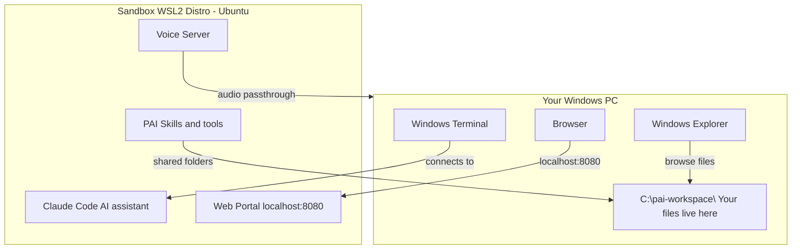

# pai-wsl2

A sandboxed AI workspace running Claude Code on Windows. One script to install, PowerShell commands to control it.

## How It Works



**The key idea:** Your AI runs in a sandbox (a mini Linux computer inside your Windows PC). Your files stay on your Windows machine in `C:\pai-workspace\`. The AI can read and write to those files, but it can't touch anything else on your PC.

## What You Need

- Windows 10 (build 19041 or later) or Windows 11
- WSL2 enabled (the installer will enable it if needed)
- An [Anthropic account](https://console.anthropic.com/) (free to create)
- About 10 minutes for the first install

## Quick Start

### Step 1: Install

Open PowerShell as Administrator (right-click the Start button, choose "Terminal (Admin)" or "PowerShell (Admin)") and paste these three lines:

```powershell
git clone https://github.com/jaredstanko/pai-wsl2.git
cd pai-wsl2
powershell -ExecutionPolicy Bypass -File install.ps1
```

The installer will download and set up everything automatically. You'll see a lot of output scrolling by -- **ignore it all** until you see the final instructions.

> **Note:** If WSL2 wasn't already enabled, the installer will enable it and ask you to restart your PC. After restarting, run `install.ps1` again and it will pick up where it left off.

### Step 2: Open a PAI Session

When the install finishes, open **Windows Terminal** and run:

```powershell
.\scripts\launch.ps1
```

A new tab will open connected to your AI workspace.

### Step 3: Sign In

Claude Code will ask you to sign in. It opens a browser -- log in with your Anthropic account.

When it asks "Do you trust /home/claude/.claude?" say **yes**.

### Step 4: Set Up the Web Portal

Once you're signed in, paste this message into the terminal:

```
Install PAI Companion following ~/pai-companion/companion/INSTALL.md.
Skip Docker (use Bun directly for the portal) and skip the voice
module. Keep ~/.vm-ip set to localhost and VM_IP=localhost in .env.
After installation, verify the portal is running at localhost:8080
and verify the voice server can successfully generate and play audio
end-to-end (not just that the process is listening). Fix any
macOS-specific binaries (like afplay) that won't work on Linux.
Set both to start on boot.
```

**Claude Code will ask you some questions. Each time press 2 (Yes) to allow it to edit settings for this session.**

Wait for it to finish. This takes a few minutes.

### Step 5: You're Done

Open http://localhost:8080 in your browser to see the web portal. Look for the PAI-Status icon in your system tray (bottom right, near the clock). From now on, just click **New PAI Session** in the tray menu, or run `.\scripts\launch.ps1` in PowerShell.

---

## What You Get

- **Sandboxed AI** -- Claude Code runs inside an isolated WSL2 distro, not directly on your Windows machine
- **System tray app** -- start sessions, stop the distro, open the web portal from one icon
- **Session resume** -- pick up previous conversations where you left off
- **Web portal** -- a local website for viewing AI-created content and exchanging files
- **Shared folders** -- `C:\pai-workspace\` on Windows is shared with the AI
- **Health check** -- run `doctor.ps1` or use the tray menu to check system health
- **Audio** -- the AI can speak through your PC speakers (Windows 11 via WSLg, Windows 10 optional)

## The System Tray App

After install, PAI-Status lives in your system tray (bottom right, near the clock). It shows a small icon with a colored dot (green = running, red = stopped).

```
PAI-Status tray menu:
  Distro: Running
  Start Distro / Stop Distro
  ──────────────────
  New PAI Session       <- opens a new AI workspace
  Resume Session        <- pick up where you left off
  ──────────────────
  Open PAI Web          <- opens the web portal
  Open a Terminal       <- plain shell (no AI)
  ──────────────────
  Health Check          <- runs doctor.ps1
  Launch at Login
  Quit PAI-Status
```

The tray app is compiled from C# source at install time using the .NET Framework compiler (`csc.exe`) that ships with every Windows 10/11 machine. No build tools or SDKs needed.

## Shared Files

Your Windows PC and the AI share files through `C:\pai-workspace\`:

```
C:\pai-workspace\
  exchange\    Drop files here -- the AI can read them
  work\        AI outputs and projects
  data\        Datasets and databases
  portal\      Web portal content
  upstream\    Reference repos
```

AI settings and memory live inside the WSL2 distro at `/home/claude/.claude` (on the fast ext4 filesystem). Your workspace files live on Windows. You can browse them in Explorer like any other folder on your PC.

### Sharing Additional Folders

The quickest way to get files into the distro is the `exchange\` folder -- just drop files there.

To give the AI permanent access to a project folder on your Windows machine:

```powershell
.\scripts\mount.ps1 C:\Projects\my-repo
```

This adds the folder to the distro's mount table and restarts the distro briefly (~2 seconds). Your directory then appears at `/home/claude/my-repo` inside the distro with live two-way access.

```powershell
.\scripts\mount.ps1 -List                                          # See what's shared
.\scripts\mount.ps1 C:\Projects\my-repo -MountAt /home/claude/code # Choose where it appears in the distro
```

### Copying Files

To copy individual files in or out, just use the shared `C:\pai-workspace\` folder. Drop files into `C:\pai-workspace\exchange\` on Windows and they appear at `/home/claude/exchange/` inside the distro (and vice versa).

You can also copy from the Windows side using the `\\wsl$\` path:

```powershell
# Copy a file from the distro to your Desktop
copy \\wsl$\pai\home\claude\work\output.pdf $env:USERPROFILE\Desktop\
```

---

## Advanced

Everything below is for power users who want to customize or troubleshoot.

### Install Options

```powershell
.\install.ps1                                  # Normal install
.\install.ps1 -Verbose                         # Show detailed output
.\install.ps1 -Name v2                         # Parallel install as a separate instance
.\install.ps1 -Name v2 -Port 8082             # Parallel install with specific portal port
```

### Parallel Installs

Use `-Name` to run multiple instances side by side. Each gets its own WSL2 distro, workspace, and portal port:

```powershell
.\install.ps1 -Name v2

# Creates:
#   Distro:    pai-v2
#   Workspace: C:\pai-workspace-v2\
#   Portal:    http://localhost:8081 (auto-assigned)
```

All scripts accept `-Name` to target a specific instance:

```powershell
.\scripts\launch.ps1 -Name v2
.\scripts\verify.ps1 -Name v2
.\scripts\upgrade.ps1 -Name v2
.\scripts\uninstall.ps1 -Name v2
```

### CLI Commands

```powershell
.\scripts\launch.ps1                 # New PAI session
.\scripts\launch.ps1 -Resume         # Resume a previous session
.\scripts\launch.ps1 -Shell          # Plain shell in the distro (no AI)
```

### Health Check

```powershell
.\scripts\doctor.ps1                 # Full diagnostic -- checks WSL2, distro, network,
                                     # disk, services, and reports PASS/WARN/FAIL
```

### Verification

```powershell
.\scripts\verify.ps1                 # Check system health (PASS/FAIL for each component)
```

### Upgrading

```powershell
cd pai-wsl2
git pull
.\scripts\upgrade.ps1
```

Your workspace, authentication, and sessions are preserved.

### Backup & Restore

```powershell
.\scripts\backup-restore.ps1 -Backup           # Back up distro + workspace
.\scripts\backup-restore.ps1 -Restore           # Restore from a backup
```

### Uninstall

```powershell
.\scripts\uninstall.ps1
```

Removes the WSL2 distro and launch scripts. Asks before deleting workspace data.

### WSL2 Distro Specs

| Setting | Default |
|---------|---------|
| Runtime | WSL2 (Hyper-V backed) |
| OS | Ubuntu 24.04 x86_64 |
| CPUs | 4 |
| Memory | 4 GB |
| Disk | 50 GB (virtual hard disk) |
| Audio | WSLg (Win 11) / PowerShell passthrough (Win 10) |
| Display | WSLg Wayland/X11 (Win 11 only) |

To resize, create or edit `%UserProfile%\.wslconfig`:

```ini
[wsl2]
processors=6
memory=6GB
swap=8GB
```

Then restart the distro:

```powershell
wsl.exe --shutdown
.\scripts\launch.ps1
```

### Troubleshooting

**Install fails at "Importing distro"** -- Run `wsl.exe --unregister pai` then `.\install.ps1` again.

**WSL2 not available** -- Make sure virtualization is enabled in your BIOS/UEFI settings. Run `wsl.exe --install` from an admin PowerShell to enable WSL2.

**No audio** -- On **Windows 11**, audio uses WSLg automatically. Run `wsl.exe -d pai -- pactl info` to check PulseAudio. If it fails, restart WSL with `wsl.exe --shutdown` and try again. On **Windows 10**, the installer asks if you want audio enabled (it requires reducing sandbox isolation). If you said yes, audio plays via PowerShell passthrough automatically.

**Web portal not loading** -- Make sure the distro is running (`wsl.exe -l -v` should show "Running"), then try http://localhost:8080.

**Distro shows as "Stopped"** -- Run `wsl.exe -d pai` to start it, or `.\scripts\launch.ps1`.

**Slow file access in shared folders** -- This is normal for cross-OS file access in WSL2. For best performance on large projects, clone repos inside the distro (`/home/claude/`) rather than in the shared workspace.

## Credits

- [WSL2](https://learn.microsoft.com/en-us/windows/wsl/) -- Windows Subsystem for Linux
- [WSLg](https://github.com/microsoft/wslg) -- GUI and audio support for WSL
- [PAI](https://github.com/danielmiessler/Personal_AI_Infrastructure) -- Personal AI Infrastructure by Daniel Miessler
- [PAI Companion](https://github.com/chriscantey/pai-companion) -- Companion package by Chris Cantey
- [Windows Terminal](https://github.com/microsoft/terminal) -- Modern terminal for Windows
